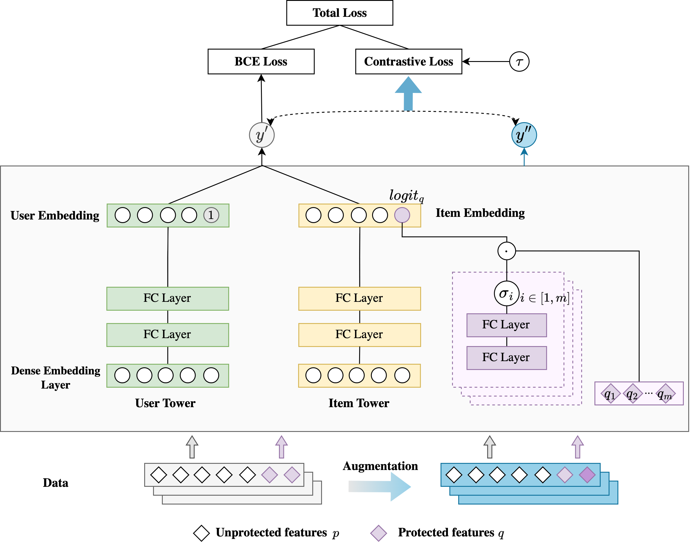

# MNAM-CL

---
This repo is the official implementation of "Monotonic Fairness in Recommendation via Neural Additive Models with Contrastive Learning".

# Introduction

---
**MNAM-CL** is a novel, explainable fairness-aware framework to address **monotonic unfairness** in recommendation systems. 
Our approach leverages monotonic neural additive models, theoretically ensuring monotonicity, and incorporates contrastive learning to enhance fairness through augmented samples.
Extensive experiments on real-world datasets demonstrate that our method significantly improves monotonic fairness while still maintaining a high level of personalization compared to state-of-the-art recommendation algorithms. 

<p align="center">
  
</p>

# Getting Started

---

## Environment Settings
```shell
pip install -r requirements.txt
```

## Fetch Dataset
```shell
mkdir -p dataset/movielens && cd dataset/movielens
wget https://raw.githubusercontent.com/MemoryForSky/deepctr/main/data/movielens.txt
```

## Example to Run
```shell
python train_and_eval.py --config_file config/fair_movielens.json
```

You will get the following result:
```shell
Epoch 1/2
19s - loss:  0.00296 - main_loss:  0.00270 - auc:  0.7263  - val_auc:  0.5787 - accuracy:  0.6059  - val_accuracy:  0.5455
2223it [00:20, 107.60it/s]
Epoch 2/2
21s - loss:  0.00250 - main_loss:  0.00223 - auc:  0.7766  - val_auc:  0.6605 - accuracy:  0.7107  - val_accuracy:  0.6175
Train metrics {'auc': 0.7715849321264515, 'accuracy': 0.7031702759738662}
Test LogLoss 0.6184
Test AUC 0.7134
Unfairness rate of item_mean_rating - irrelevant: 0.00004996
Unfairness rate of item_mean_rating - reverse: 0.00000000
```
*The result may be slightly different due to random seeds.
